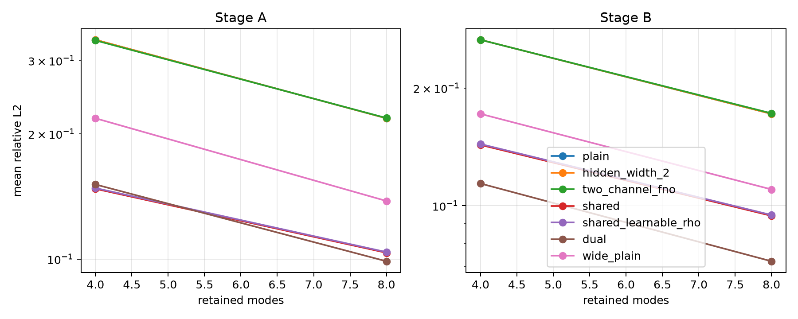
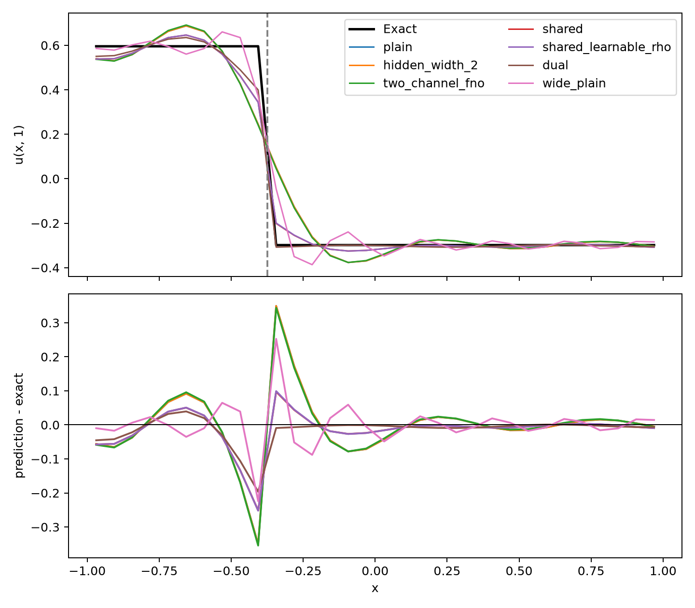
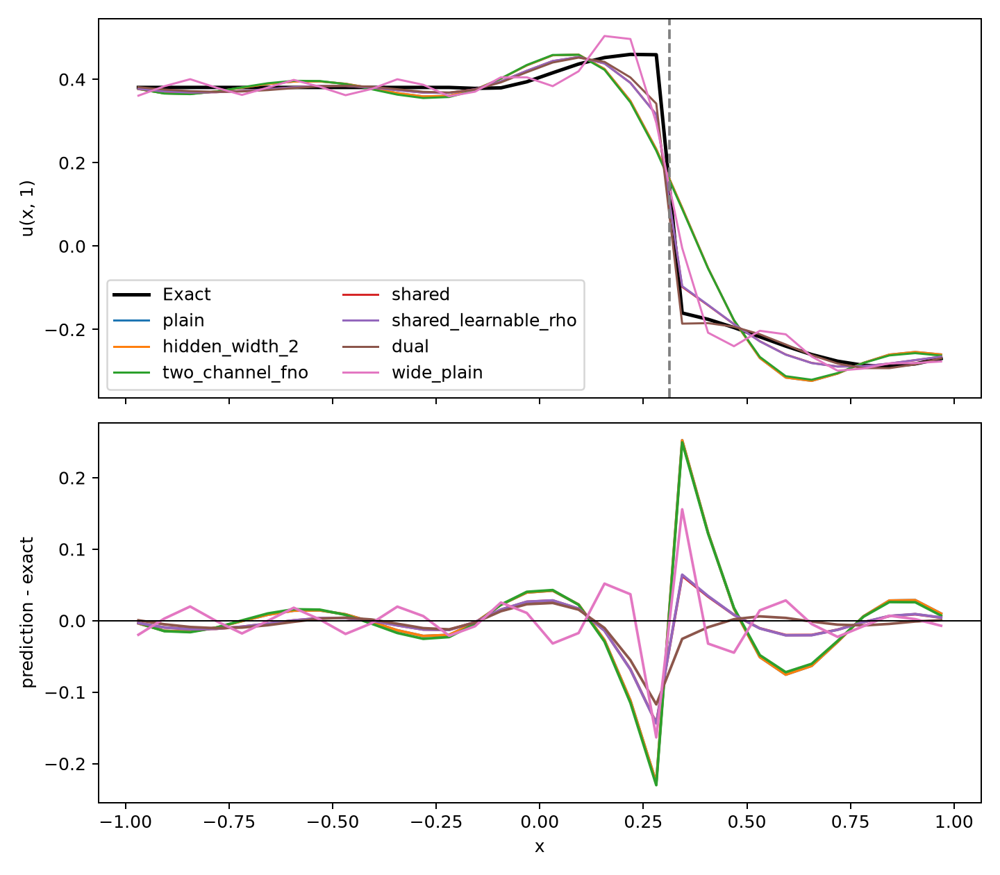

# 1D Advection Equation Test Report

## Material Passport

- **Origin**：本工作区 `advection_fno` 的一次本地 smoke 实验。
- **结果目录**：[`results/smoke_hidden_width_2`](results/smoke_hidden_width_2)。
- **版本标签**：`smoke_summary_v1`。
- **分析日期**：2026-07-17。
- **验证状态**：`ANALYZED`。本报告基于已保存的单随机种子 smoke 结果；结论用于判断方法是否值得进入正式 GPU 实验，尚不是多随机种子、全分辨率意义下的最终统计结论。

## 1. 执行摘要

本次测试验证的核心问题是：当对流方程的解在已知位置发生跳跃时，将输入和输出两端的间断特征 $\gamma_0,\gamma_1$ 显式置入谱算子核，能否比普通线性 Fourier 算子更准确地表示该跳跃。

在当前 smoke 设置（$N=32$、一个随机种子、保留模态数 $M\in\{4,8\}$）下，答案是肯定的：双乘子模型 `dual` 在 Stage A 和 Stage B 的独立测试集上均取得最小相对 $L^2$ 误差和最小界面邻域 MAE。以 $M=8$ 为例，`dual` 相对于 `plain` 的相对 $L^2$ 误差降低了 54.7%（Stage A）和 58.0%（Stage B）；相对于参数更多的 `wide_plain` 仍降低了 28.4% 和 34.5%。

这一优势不是简单增加参数或增加输入通道造成的：`hidden_width_2` 与 `plain` 完全重合；把 $(u_0,\gamma_0)$ 直接输入普通两通道线性 FNO 的 `two_channel_fno` 也与 `plain` 基本相同。相反，必须使用乘积特征 $\gamma_0u_0$，并在输出端以 $\gamma_1$ 门控，才能得到明显改进。

同时，本次结果也暴露出一个重要限制：对于端点连续控制样本，独立训练的特征模型并没有自动匹配独立训练 `plain` 的连续情形误差。因此，当前模型已显示出处理**已知、正确输运的内部界面**的潜力，但还不能声称它在“界面不存在或界面信息失真”时保持同等稳健性。

相关原始结果可在 [`summary.csv`](results/smoke_hidden_width_2/summary.csv)、[`comparisons.csv`](results/smoke_hidden_width_2/comparisons.csv) 和 [`manifest.json`](results/smoke_hidden_width_2/manifest.json) 中复查；模型和实验逻辑分别见 [`models.py`](models.py) 与 [`experiment.py`](experiment.py)。

## 2. 理论方法

### 2.1 问题与精确解

测试方程为一维常速对流方程

$$
u_t+c u_x=0,\qquad x\in[-1,1],\quad t\in[0,1],
$$

其中速度 $c=0.5$ 固定，采用非周期入流—出流边界。给定初值 $u_0$ 后，终止时刻的解由平移精确给出：

$$
u_1(x)=u_0(x-cT),\qquad T=1.
$$

每个样本至多有一个跳跃位置 $s$。以二值特征标记间断两侧，初始和输出时刻的特征分别为

$$
\gamma_0(x)\in\{-1,+1\},\qquad \gamma_1(x)=\gamma_0(x-cT).
$$

当 $s=\pm1$ 时，域内没有内部跳跃；这些样本作为“连续退化”控制组。Stage A 只含分段常数跳跃，Stage B 在跳跃上叠加紧支撑平滑背景，因此分别检验纯跳跃恢复与“平滑背景 + 跳跃”恢复。

### 2.2 从连续谱核到特征条件化不连续核

普通单层线性谱算子可写成

$$
\bigl(\mathcal{K} f\bigr)(x)
= \mathcal{F}^{-1}\!\bigl(R(k)\widehat{f}(k)\bigr)(x).
$$

本测试的关键不是把 $\gamma$ 作为普通附加通道，而是让它出现在核的输入端与输出端：

$$
\mathcal T_\gamma f
=\mathcal K_0f+\gamma_1\mathcal K_1(\gamma_0 f).
$$

其对应 Green 核为

$$
G_\gamma(x,y)=\kappa_0(x-y)+\gamma_1(x)\kappa_1(x-y)\gamma_0(y).
$$

即使 $\kappa_0$、$\kappa_1$ 是平滑的平移不变核，$\gamma_1(x)\gamma_0(y)$ 也会使拉回到物理坐标的核在界面处具有分块/不连续结构。输出端的 $\gamma_1$ 因而能把平滑谱卷积的结果转化为在正确输运位置处可跳跃的预测。

### 2.3 比较模型

所有模型均是**单层、线性、零填充谱卷积**；固定模型通过带岭正则的正规方程求全局最优，只有 `shared_learnable_rho` 通过 Optax 优化一个标量 $\rho$ 与共享谱乘子。$M$ 表示保留的低频 Fourier 模态数。

| 模型 | 算子/输入形式 | 对照目的 |
|---|---|---|
| `plain` | $\mathcal Ku_0$ | 普通单通道线性 FNO 基线。 |
| `hidden_width_2` | $\mathcal K_1u_0+\mathcal K_2u_0$ | 两个隐藏通道的线性负对照；函数空间与 `plain` 相同。 |
| `two_channel_fno` | $\mathcal K_u u_0+\mathcal K_\gamma\gamma_0$ | 直接把 $\gamma_0$ 当作第二输入通道；没有 $\gamma_0u_0$ 和 $\gamma_1$ 输出门控。 |
| `wide_plain` | $\mathcal K_{2M}u_0$ | 以约两倍模态数增加普通模型容量。 |
| `shared` | $a\mathcal Ku_0+b\gamma_1\mathcal K(\gamma_0u_0)$ | 单一共享乘子；固定 $\rho=0$，故 $a=b=0.5$。 |
| `shared_learnable_rho` | 与 `shared` 相同 | 令 $\rho=\mathrm{sigmoid}(\eta)$ 可学习，$a=(1+\rho)/2$、$b=(1-\rho)/2$。 |
| `dual` | $\mathcal K_0u_0+\gamma_1\mathcal K_1(\gamma_0u_0)$ | 两个独立谱乘子；主方法。 |

`hidden_width_2` 的正规方程解满足 $\mathcal K_1=\mathcal K_2=\mathcal K_{\mathrm{eff}}/2$（分支岭系数相应调整），因此理论上及数值上都应与 `plain` 重合。这是检验“性能提升是否只是隐藏宽度增加”的严格负对照。

## 3. 实施策略

### 3.1 数据、划分与数值设置

| 项目 | 当前 smoke 设置 |
|---|---|
| 空间网格 | $N=32$，均匀网格 $[-1,1]$ |
| 训练集 | Stage A 64 个，Stage B 96 个 |
| 验证集 | 每个 Stage 16 个 |
| 独立测试集 | 每个 Stage 32 个 |
| 诊断集 | 每个 Stage 24 个；用于特征消融与端点控制 |
| 随机种子 | 1 个（seed 0） |
| 模态数 | $M=4,8$；`wide_plain` 使用 $2M$ |
| 精度与运行 | JAX x64；本次为本地 CPU smoke 运行 |

实验采用训练、验证、测试严格分离的数据生成随机数。当前实现保存了验证集，但 smoke 流程没有用验证误差做早停或超参数选择；因此它主要用于检验实现、结构差异和预期现象，而非调参后的最终性能报告。

### 3.2 测量指标与比较方式

主要指标均是越小越好：

- **相对 $L^2$ 误差**：全域预测误差；
- **界面邻域 MAE**：以真实输运后的跳跃位置为中心的局部绝对误差；
- **过冲量**：预测在真实两侧状态范围外的振铃幅度；
- **跳跃幅度误差**：预测跳跃幅度与真值之差；
- **端点控制**：$s=\pm1$ 时，监测相对于 `plain` 的误差比与伪跳跃。

模型间差异使用配对 bootstrap（当前 smoke 为 200 次、对测试样本重采样）给出 95% 区间。它衡量的是此固定种子数据集中的样本不确定性；由于只有一个训练随机种子，不能替代跨种子的统计检验。

### 3.3 针对“是否真正使用界面”的消融

对特征模型额外执行以下诊断：

- 不将 $\gamma_1$ 随对流平移，即错误输出界面；
- 将输出界面左右错移 $1,2,4$ 个网格；
- 将二值界面平滑为宽度 $1,2,4$ 个网格；
- 令特征恒定，移除内部界面；
- 使用非网格对齐的跳跃位置；
- 用 $s=\pm1$ 生成域内连续的端点控制样本。

这些实验不是为了让模型在错误特征下获得好分数；其作用是验证性能提升是否确实来自正确的 $\gamma_0,\gamma_1$，而不是偶然的参数量或数据泄漏。

## 4. 测试效果

### 4.1 总体误差：`dual` 在两个 Stage 均最佳

下表给出 $M=8$ 时独立测试集的均值，所有数值越小越好。`hidden_width_2` 与 `plain` 的逐样本预测在数值精度内完全一致，因此表中相同不是四舍五入巧合。

| 模型 | A 相对 $L^2$ | A 界面 MAE | A 过冲 | B 相对 $L^2$ | B 界面 MAE | B 过冲 |
|---|---:|---:|---:|---:|---:|---:|
| `plain` | 0.2179 | 0.1712 | 0.1060 | 0.1718 | 0.1840 | 0.0823 |
| `hidden_width_2` | 0.2179 | 0.1712 | 0.1060 | 0.1718 | 0.1840 | 0.0823 |
| `two_channel_fno` | 0.2182 | 0.1715 | 0.1058 | 0.1723 | 0.1842 | 0.0826 |
| `wide_plain` | 0.1379 | 0.1096 | 0.0891 | 0.1101 | 0.1178 | 0.0723 |
| `shared` | 0.1035 | 0.0837 | 0.0572 | 0.0942 | 0.0888 | 0.0453 |
| `shared_learnable_rho` | 0.1039 | 0.0843 | 0.0574 | 0.0947 | 0.0894 | 0.0456 |
| `dual` | **0.0988** | **0.0633** | 0.0648 | **0.0721** | **0.0632** | **0.0424** |



图中两种 Stage 和两个模态数呈现一致排序：`dual` 最低，`shared` 与可学习 $\rho$ 版本紧随其后，`wide_plain` 虽比 `plain` 更强但仍存在明显差距，而 `hidden_width_2` 和 `two_channel_fno` 未出现系统提升。也就是说，更高的频谱容量有帮助，但不能替代在核两端使用界面特征的结构。

可学习版本最终学得的 $\rho$ 分别为 Stage A 的 0.0075 和 Stage B 的 0.0077，接近固定 `shared` 采用的 $\rho=0$。在这个数据分布上，让 $\rho$ 自由学习没有带来额外收益，说明强跨界面解耦已足够；这不是对其他方程或噪声数据的普适结论。

### 4.2 预测曲线：差异集中在输运后的界面附近



Stage A 的代表性样本只含跳跃。`plain`、`hidden_width_2` 和 `two_channel_fno` 在跳跃处呈现典型有限模态平滑/振铃；`wide_plain` 缩小了过渡带但未消除该问题。`shared` 与 `dual` 则利用输出门控在虚线标记的输运界面处形成更陡的过渡，其中 `dual` 的局部偏差最小。



Stage B 同时要求恢复光滑背景和跳跃。`dual` 的两个独立乘子分别承担背景项与界面项，因此既保持背景形状，也更准确地定位/恢复跳跃；共享乘子 `shared` 已显著优于普通模型，但自由度较少，局部误差略大。

### 4.3 配对比较：不是参数量或普通双通道带来的收益

下表为 $M=8$ 的均值百分比改善，正值表示前者误差更低；括号内是配对样本 bootstrap 的 95% 区间。完整逐指标结果见 [`comparisons.csv`](results/smoke_hidden_width_2/comparisons.csv)。

| Stage | 比较 | 界面 MAE 改善 | 过冲改善 | 相对 $L^2$ 改善 |
|---|---|---:|---:|---:|
| A | `dual` 相对 `plain` | 63.0% [57.4%, 68.1%] | 38.9% [18.6%, 54.7%] | 54.7% [47.5%, 62.0%] |
| A | `dual` 相对 `two_channel_fno` | 63.1% [57.6%, 68.3%] | 38.7% [18.4%, 54.6%] | 54.7% [47.6%, 62.1%] |
| A | `dual` 相对 `wide_plain` | 42.2% [31.5%, 52.2%] | 27.2% [2.7%, 47.0%] | 28.4% [20.4%, 37.1%] |
| A | `shared` 相对 `plain` | 51.1% [49.7%, 52.1%] | 46.1% [38.5%, 53.2%] | 52.5% [42.7%, 62.1%] |
| B | `dual` 相对 `plain` | 65.7% [59.3%, 70.7%] | 48.5% [32.9%, 61.9%] | 58.0% [52.8%, 64.3%] |
| B | `dual` 相对 `two_channel_fno` | 65.7% [59.4%, 70.8%] | 48.6% [33.1%, 62.1%] | 58.2% [52.9%, 64.5%] |
| B | `dual` 相对 `wide_plain` | 46.4% [35.5%, 55.4%] | 41.3% [20.2%, 58.2%] | 34.5% [27.3%, 41.3%] |
| B | `shared` 相对 `plain` | 51.8% [50.5%, 53.3%] | 44.9% [34.6%, 57.4%] | 45.1% [41.7%, 48.6%] |

作为反证，`hidden_width_2` 相对 `plain` 的三个改善均严格为 0；`two_channel_fno` 相对 `plain` 的差异小于 0.5%，且大多数 bootstrap 区间跨过 0。它们共同支持如下解释：本测试中的增益来自结构化交互 $\gamma_1\mathcal K(\gamma_0u_0)$，而非线性模型不存在时的“多通道本身”。

### 4.4 特征消融：正确的输出界面是收益的必要条件

下表选取 Stage B、$M=8$ 的相对 $L^2$ 误差，展示测试时人为扰动特征后的结果。`iid` 为正确特征；其余列均为只改测试输入特征、不重新训练。数值增大意味着模型确实依赖该特征。

| 模型 | 正确特征 | $\gamma_1$ 不平移 | $\gamma_1$ 右移 2 格 | 恒定 $\gamma$ | $\gamma$ 平滑 2 格 |
|---|---:|---:|---:|---:|---:|
| `two_channel_fno` | 0.1723 | 0.1723 | 0.1723 | 0.1719 | 0.1721 |
| `shared` | 0.0942 | 0.4598 | 0.2562 | 0.1790 | 0.1925 |
| `shared_learnable_rho` | 0.0947 | 0.4570 | 0.2554 | 0.1789 | 0.1922 |
| `dual` | **0.0721** | 0.6304 | 0.3084 | 0.1764 | 0.2140 |

`two_channel_fno` 不使用 $\gamma_1$，故前三列不变；这也解释了它为何没有学到界面随时间移动的显式机制。相反，`shared` 和 `dual` 在不平移或错移输出特征时明显变差，表明它们并非仅把 $\gamma$ 当作无关辅助量，而是使用它决定预测跳跃的位置。Stage A 有相同趋势：`shared` 从 0.1035 升至 0.5128，`dual` 从 0.0988 升至 0.6998（均为 $\gamma_1$ 不平移）。

这既是机制验证，也限定了适用条件：若实际任务只能给出不准的界面位置，模型需要与界面追踪、界面预测或不确定性建模结合，而不能把这里的 iid 成绩直接外推。

### 4.5 连续端点控制：当前尚未满足稳健性目标

将跳跃位置设为 $s=\pm1$ 后，域内样本退化为连续样本。Stage B、$M=8$ 的连续端点控制给出以下现象：

- `two_channel_fno` 相对 `plain` 的误差比为 1.144，95% 区间为 [1.087, 1.201]；
- `shared`、`shared_learnable_rho` 和 `dual` 的误差比分别为约 5.50、5.52 和 4.08；
- 各模型的平均伪跳跃均约为 0.022（`plain` 本身也是 0.022），故它没有显示出特征模型特有的额外伪跳跃；但也说明当前预设的 $\le 0.01$ 绝对阈值连基线都未满足，不能据此把问题归因于特征结构。

这不与 `shared` 的代数恒等性矛盾：当 $\gamma$ 为常数且**使用同一个乘子**时，固定 $\rho=0$ 的共享形式会化为 $\mathcal Ku_0$。但本实验中的 `plain`、`shared` 和 `dual` 是分别在含内部跳跃的训练分布上拟合的，所学谱乘子不同；因此，结构上的退化并不强制其在未见的连续子分布上输出相同函数。Stage A 的连续端点目标为常数、`plain` 误差极小，导致相对误差比数值不稳定，不能据此作出正面结论。

## 5. 总结评价与下一步

### 总结评价

1. **理论方法是自洽且被本次结果直接支持的。** 把 $\gamma$ 放入核的输入端和输出端，得到的是特征条件化的 Green/Fourier 核，而不仅是“多加一个输入通道”。在已知且正确输运的界面条件下，这种结构允许有限模态谱算子在指定位置产生跳跃。
2. **`dual` 是当前最有效的实现。** 它在纯跳跃及平滑背景加跳跃两类数据上均为最佳；两个独立乘子带来的增益，超过了单纯增加两倍频谱模态的 `wide_plain`。
3. **对照设计排除了两个简单解释。** 两隐藏通道与普通模型严格等价；普通双输入通道也未提高性能。因此，现有证据更支持“乘积特征 + 输出端门控”的结构性解释。
4. **证据仍是初步的。** 当前只使用 $N=32$、单个训练种子和 32 个测试样本。bootstrap 区间说明了本次测试集的配对样本差异，但不能说明跨数据集、跨初始化或跨分辨率的显著性。
5. **连续退化不是自动保证。** 正确界面下的优势与端点连续控制的退化同时存在；在发表级实验前，必须把这一项视作待解决问题，而不是忽略的边界案例。

### 建议的正式 GPU 实验

下一步建议直接运行全量预设，并把本报告的 smoke 现象视为待复现的假设：

```bash
C:\\Users\\Hollon\\miniconda3\\envs\\jax\\python.exe -m advection_fno.experiment --preset full --stage all --output-dir results/full --save-data --x64
```

正式实验至少应做到：

- 使用 $N=256$、5 个或更多训练种子，并按**种子**汇总均值、标准差和置信区间；
- 保留本报告全部正/负对照与特征消融，避免只报告 iid 主结果；
- 将端点连续样本混入训练或验证，比较加权损失、连续性约束、特征可靠性门控等改进；
- 报告随 $M$、训练集大小和对流距离变化的收敛曲线；
- 以独立测试集一次性确定主结论，避免在该 smoke 测试集上反复做结构选择。

**最终判断：** 该构造已通过一个严格但小规模的机制测试，值得进入正式 GPU 实验；目前最可靠的结论是“已知输运界面能显著帮助线性谱算子恢复跳跃”，而不是“该方法已经在所有连续/间断场景中全面优于普通 FNO”。
