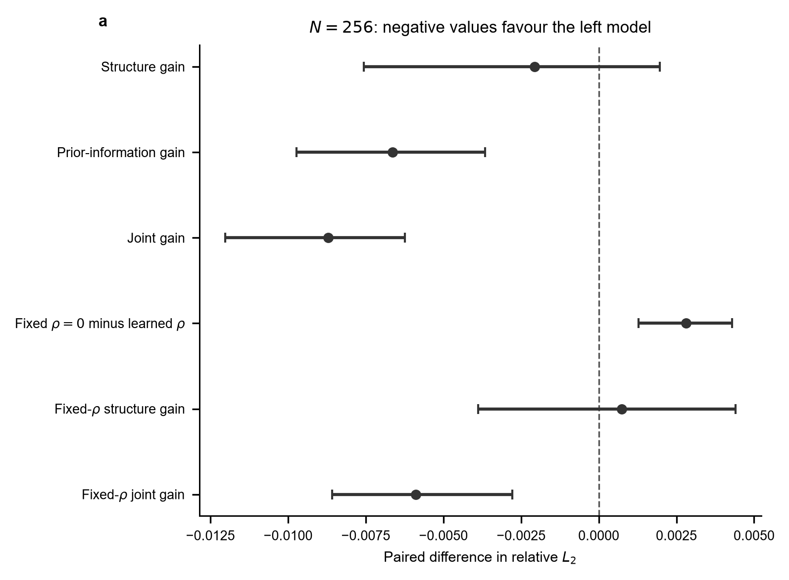
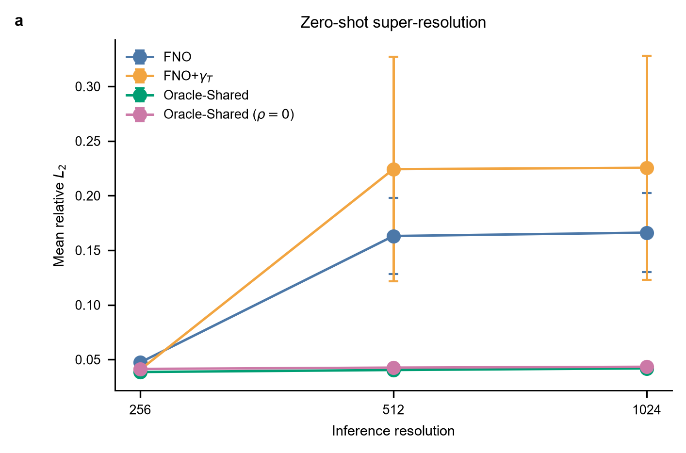
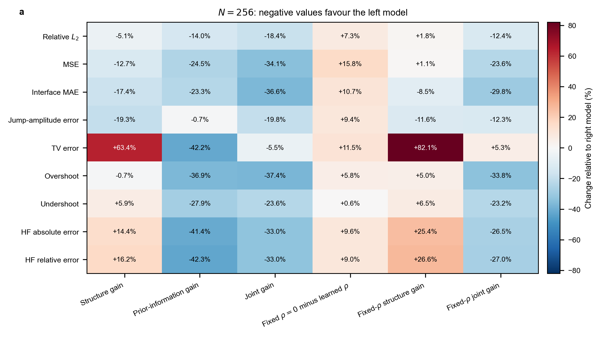
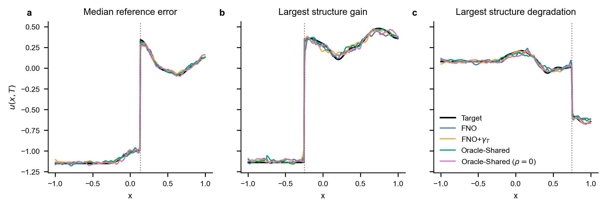
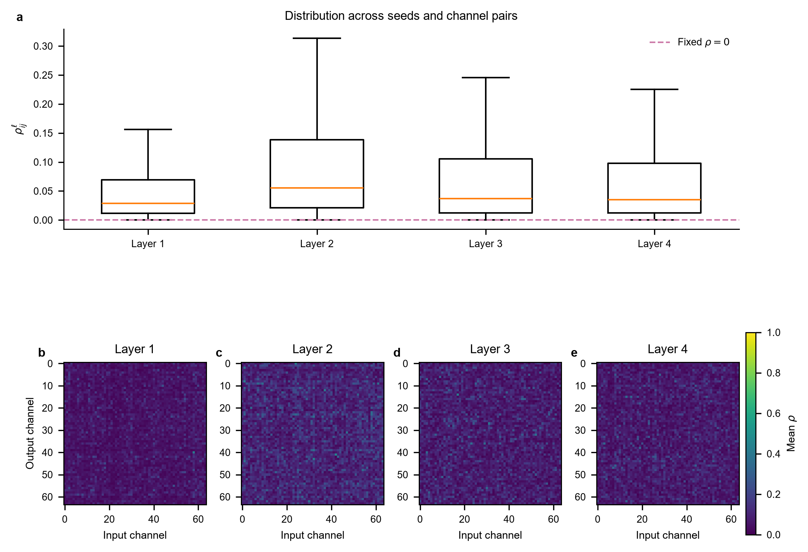
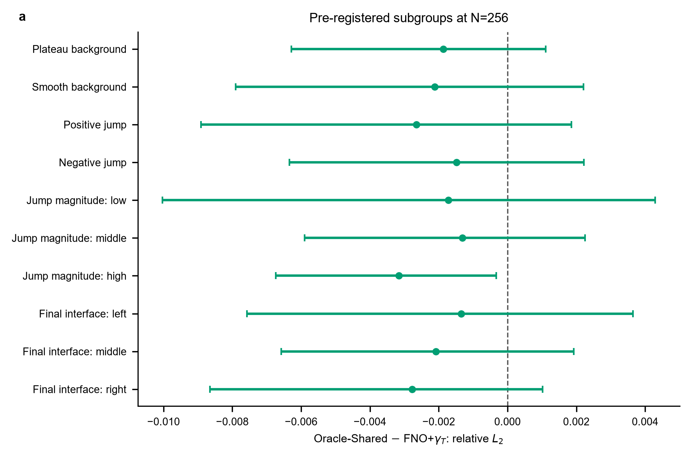

# Deep FNO / Shared Benchmark v2 四模型正式对比测试报告

## 技术摘要

本报告比较 FNO、FNO+$\gamma_{T}$、Oracle-Shared 和 Oracle-Shared（固定 $\rho=0$）四个模型。实验只包含区域内部的非零间断；每个模型训练 5 个 seed，四模型对同一组 4,000 个测试 case 进行严格配对评估。原 v2 协议的主终点是 $N=256$ 时 Oracle-Shared−FNO+$\gamma_{T}$ 的逐样本相对 $L_{2}$ 差异；固定 $\rho=0$ 模型是后注册补充消融。

Oracle-Shared 的平均相对 $L_{2}$ 为 0.03862，低于 FNO+$\gamma_{T}$ 的 0.04069，差异为 -0.00207（-5.1%，95% 分层配对 bootstrap 区间 [-0.00756, +0.00197]）。该区间跨越零，故本实验**不能证明**固定门控相对于“仅把 $\gamma_{T}$ 当作输入”的 FNO 在训练分辨率上具有稳定的额外整体相对 $L_{2}$ 收益。

相反，提供解析终态界面先验本身带来稳定改善：FNO+$\gamma_{T}$−FNO 的差异为 -0.00663（-14.0%，95% 区间 [-0.00972, -0.00366]），Oracle-Shared−FNO 的联合差异为 -0.00870（-18.4%，95% 区间 [-0.01203, -0.00624]）。后注册消融表明，可学习 $\rho$ 在 $N=256$ 上优于固定 $\rho=0$：固定 $\rho=0$−可学习 $\rho$ 为 +0.00281（+7.3%，95% 区间 [+0.00128, +0.00430]）。在零样本 $N=512$ 和 $N=1024$ 推理时，Oracle-Shared 的误差接近 $N=256$ 的水平，而两个普通 FNO 基线明显退化。

## 1. 问题设置以及训练、验证、测试数据的生成

### 1.1 受控一维输运问题

研究对象是区间 $[-1,1]$ 上的一维线性平流算子。速度为 $c=0.5$、终止时间为 $T=1$，因此解析位移为 0.5。每个样本由紧支撑平滑背景和一个跳跃组成；初态和终态由同一组连续参数在不同输运位置解析计算。该设置学习的是“初态解场与界面信息如何映射为终态解场”，并不测试从数据中识别未知边界条件。

界面符号场 $\gamma$ 在界面左侧为 -1、右侧为 +1。v2 删除了连续、端点和离开区域的样本，只保留内部非零跳跃，因此每个样本都可计算界面误差与跳跃幅值误差。

| 项目 | 实际设置 |
| --- | --- |
| 协议版本与运行标签 | `protocol_version=2` / `main_v2` |
| 空间区域 | $[-1,1]$ |
| 初态界面 | $\xi_{0}\sim\mathcal{U}[-0.75,0.25]$ |
| 终态界面 | $\xi_{T}=\xi_{0}+0.5\in[-0.25,0.75]$ |
| 跳跃幅值 | $|[u]|\sim\mathcal{U}[0.5,1.5]$，正负号等概率 |
| 平滑背景 | 均值在 $[-0.5,0.5]$ 采样；8 个正弦/余弦项，经紧支撑包络与 $k^{1.5}$ 谱衰减加权 |
| 平台背景 | 20% 样本将全部正弦/余弦系数置零 |
| 训练网格 | $N=256$ |

表 1 定义了数据分布。界面位置的限制确保初态和终态间断都位于区域内部。紧支撑背景会使区域端部呈常数，但每个样本仍具有一个非零跳跃，因此训练和测试对象不是全局平滑函数。

### 1.2 数据拆分、随机性与跨分辨率对应

| 数据部分 | 每个训练 seed 的规模 | 生成随机 seed | 作用 |
| --- | ---: | ---: | --- |
| 训练集 | 16,000 | $10{,}000+s$ | 训练参数并拟合该 seed 的归一化器 |
| 验证集 | 2,000 | $20{,}000+s$ | 选择最佳 checkpoint |
| 测试集 | 4,000 | 90,000，固定 | 所有模型和 seed 的配对比较 |

表 2 中 $s\in\{0,1,2,3,4\}$。同一 seed 下四个模型使用相同的训练与验证 case；测试集则是所有 seed 与所有模型共享的同一组 4,000 个物理 case。因此，每个模型、每个分辨率有 $5\times4{,}000=20{,}000$ 个逐样本预测误差，但它们不是 20,000 个独立训练重复：4,000 个测试样本嵌套在 5 个训练 seed 内。

连续参数只生成一次，然后在 $N=256$、512、1024 的胞心网格上解析采样。同一个 `sample_id` 在三种分辨率上具有完全相同的背景、跳跃幅值和界面位置；高分辨率测试不是把低分辨率预测插值后再评分。

## 2. 四个模型的架构

四个模型都使用相同的主干规模：4 个谱层、64 个隐藏通道、每层 16 个 Fourier 模态、lifting/projection 通道 128/128，以及 0.5 的 padding 比例。差异只在输入通道和 Shared 谱层如何使用界面信息。

| 模型 | 输入通道 | 参数量 | $\gamma_{T}$ 的用途 | 对照目的 |
| --- | --- | ---: | --- | --- |
| FNO | $(x,u_{0},\gamma_{0})$ | 557,889 | 不提供 | 基础基线 |
| FNO+$\gamma_{T}$ | $(x,u_{0},\gamma_{0},\gamma_{T})$ | 558,017 | 第四个普通输入通道 | 量化先验信息收益 |
| Oracle-Shared | 同上 | 574,401 | 第四输入，且作为固定谱层门控 | 检验结构化使用先验的附加作用 |
| Oracle-Shared（$\rho=0$） | 同上 | 558,017 | 与 Oracle-Shared 相同 | 后注册消融：检验可学习 $\rho$ 的作用 |

表 3 显示，FNO+$\gamma_{T}$ 仅因第四输入而比 FNO 多出少量参数。Oracle-Shared 多出的 16,384 个参数是四层 $64\times64$ 的可学习 $\rho$ 矩阵。固定 $\rho=0$ 模型不含可训练 `rho_eta`，故参数量与 FNO+$\gamma_{T}$ 相同。

v2 Oracle-Shared 不使用 v1 的 $q_{\ell}$、soft-$\tanh$ 或 `gamma_blocks` 递推网络。四个谱层固定使用如下门控对：

$$
(\gamma_{0},\gamma_{T}),\quad
(\gamma_{T},\gamma_{T}),\quad
(\gamma_{T},\gamma_{T}),\quad
(\gamma_{T},\gamma_{T}).
$$

每个 Oracle-Shared 谱层、每个隐藏通道对都有 $\rho_{ij}^{\ell}\in[0,1]$，用于混合普通谱分支和受 $\gamma$ 调制的谱分支。固定 $\rho=0$ 消融令所有 $a_{ij}^{\ell}=b_{ij}^{\ell}=0.5$。四种模型均仅最小化终态解场 MSE；不训练或监督预测 $\gamma$。

## 3. 如何训练和测试

### 3.1 训练、checkpoint 与审计

四模型均在 $N=256$ 上完整训练 500 个 epoch，不使用早停。优化器为 AdamW：峰值学习率 $10^{-3}$、权重衰减 $10^{-4}$、batch size 为 64、全局梯度裁剪阈值为 1.0。学习率在前 5% 训练步线性 warm-up，之后按余弦日程衰减到峰值的 1%。

每 10 个 epoch 输出训练损失、验证 MSE 和验证相对 $L_{2}$，并保存当前参数。`checkpoint_best.npz` 保存验证相对 $L_{2}$ 最小的 epoch；`checkpoint_final.npz` 保存第 500 个 epoch；正式推理只读取最佳 checkpoint。20 个模型×seed 单元的 [产物审计](source_data/artifact_audit.csv) 表明：每份 history 均有 500 行、最终 epoch 均为 500、最佳 epoch 位于 493–500；需要 $\gamma_{T}$ 的模型均通过输入一致性检查，两个 Oracle 模型的门控误差均为零。

### 3.2 指标、配对与不确定性

每个最佳 checkpoint 在 $N=256$、512、1024 上直接推理，不重新训练或微调。$N=256$ 对每个预测样本计算九项指标：

| 指标 | 评价的误差特征 |
| --- | --- |
| 相对 $L_{2}$ | 相对整体误差；本实验主指标 |
| MSE | 整体绝对平方误差 |
| Interface MAE | 真值界面 $\xi_{T}$ 左右 0.05 窗口内的平均绝对误差 |
| Jump-amplitude error | 界面两侧窗口估计的跳跃高度误差 |
| TV error | 总变差误差，反映过度平滑或伪振荡 |
| Overshoot / undershoot | 非物理过高峰值 / 过低谷值 |
| 高频绝对误差 | Fourier 索引 $k\ge16$ 的频谱尾部绝对误差 |
| 高频相对误差 | 高频尾部相对真值能量的误差 |

表 4 的所有指标均是越小越好，且在反归一化后的物理解场上计算。高频相对误差只在真值高频尾部非忽略时定义；本批结果的有效比例为 1.0。

模型对比统一计算“左模型误差减右模型误差”，负值表示左模型更好。点估计来自全部 5 个 seed × 4,000 个配对测试预测。95% 区间使用 10,000 次分层配对 bootstrap：每次先有放回抽取 5 个 seed，再在每个被抽 seed 内有放回抽取 4,000 个共享测试样本；四个模型始终使用同一组抽样索引。该过程同时保留训练随机性与测试样本随机性。

## 4. 测试结果与图表解释

### 4.1 主终点：先验信息收益明确，结构化门控的额外收益未被证实

| 对比（左−右） | 左侧均值 | 右侧均值 | 差异 | 95% 区间 | 相对变化 |
| --- | ---: | ---: | ---: | --- | ---: |
| Oracle-Shared − FNO+$\gamma_{T}$ | 0.03862 | 0.04069 | -0.00207 | [-0.00756, +0.00197] | -5.1% |
| FNO+$\gamma_{T}$ − FNO | 0.04069 | 0.04732 | -0.00663 | [-0.00972, -0.00366] | -14.0% |
| Oracle-Shared − FNO | 0.03862 | 0.04732 | -0.00870 | [-0.01203, -0.00624] | -18.4% |
| Oracle-Shared（$\rho=0$）− Oracle-Shared | 0.04143 | 0.03862 | +0.00281 | [+0.00128, +0.00430] | +7.3% |
| Oracle-Shared（$\rho=0$）− FNO+$\gamma_{T}$ | 0.04143 | 0.04069 | +0.00074 | [-0.00388, +0.00441] | +1.8% |
| Oracle-Shared（$\rho=0$）− FNO | 0.04143 | 0.04732 | -0.00589 | [-0.00858, -0.00279] | -12.4% |

表 5 给出 $N=256$ 主指标的精确结果，原始数值见 [主结果表](source_data/main_results_table.csv)。前三行是原 v2 协议：第二行说明“知道 $\gamma_{T}$”本身稳定提升 FNO；第一行才是结构化门控能否带来额外整体收益的检验。第一行区间跨零，故不能把 Oracle-Shared 较低的点估计描述为已证实的结构优势。后三行是固定-$\rho$ 的后注册消融，不改变原主终点。

图 1 将表 5 的均值差与 95% 区间画成森林图，虚线表示零差异。主比较横线穿过零；先验信息收益和联合收益横线完全位于零左侧；固定 $\rho=0$ 减去可学习 $\rho$ 完全位于零右侧。它直观说明必须把“提供 $\gamma_{T}$”“结构化使用 $\gamma_{T}$”和“学习 $\rho$”解释为三个不同的贡献。

### 4.2 零样本超分辨率：Oracle-Shared 在更细网格上保持稳定

| 推理分辨率 | FNO | FNO+$\gamma_{T}$ | Oracle-Shared | Oracle-Shared（$\rho=0$） |
| --- | ---: | ---: | ---: | ---: |
| $N=256$ | 0.04732 ± 0.00327 | 0.04069 ± 0.00440 | 0.03862 ± 0.00201 | 0.04143 ± 0.00179 |
| $N=512$ | 0.16309 ± 0.03491 | 0.22428 ± 0.10282 | 0.04043 ± 0.00195 | 0.04265 ± 0.00167 |
| $N=1024$ | 0.16618 ± 0.03615 | 0.22553 ± 0.10250 | 0.04193 ± 0.00229 | 0.04340 ± 0.00175 |

表 6 是五个 seed 的平均相对 $L_{2}$ ± seed 间标准差，完整数值见 [超分辨率汇总](source_data/superresolution_summary.csv)。Oracle-Shared 与固定 $\rho=0$ 模型的误差在三种分辨率间接近不变，而 FNO 与 FNO+$\gamma_{T}$ 在更细网格上均值和 seed 间离散度都大幅上升。该表衡量的是不重训、不微调的分辨率外推，并非高分辨率重新训练后的性能上限。

图 2 将表 6 可视化，点为五 seed 均值，误差线为其标准差。Oracle-Shared 相对 FNO+$\gamma_{T}$ 在 $N=512$ 的配对差异为 -0.18385，95% 区间 [-0.26926, -0.10924]；在 $N=1024$ 为 -0.18361，95% 区间 [-0.26809, -0.10927]。这支持“结构化门控与高分辨率直接推理的稳定性相关”的描述，但结论仍限于解析 $\gamma_{T}$ 已知的一维数据协议。

### 4.3 九项指标：界面与跳跃改善伴随总变差和高频权衡

图 3 的每个单元格是左模型相对右模型的误差百分比变化，负值表示左模型误差更低；完整均值差和区间见 [配对 bootstrap 结果](source_data/paired_hierarchical_bootstrap.csv)。热图适合比较方向和量级，不应以颜色替代置信区间。

对原主比较，Oracle-Shared 相对 FNO+$\gamma_{T}$ 的界面 MAE 降低 17.4%，跳跃幅值误差降低 19.3%，但 TV error 增加 63.4%，高频绝对/相对误差分别增加 14.4%/16.2%。这说明固定门控会改变误差构成：界面局部量更好，却不在所有全局和频谱指标上占优。相比之下，FNO+$\gamma_{T}$ 相对于 FNO 在 MSE、界面 MAE、TV、过冲、欠冲和两项高频误差上均呈改善方向；Oracle-Shared 相对于 FNO 的联合比较在整体、界面和高频指标上改善更明显。

### 4.4 代表性剖面：逐样本结构收益存在异质性

图 4 的样本不是人工挑选：左栏的 FNO+$\gamma_{T}$ 参考误差最接近全体中位数；中栏使 Oracle-Shared−FNO+$\gamma_{T}$ 最小；右栏使该差异最大。三者的测试索引为 164、1940 和 3728。四条模型曲线均为五 seed 预测的平均，竖虚线为真实终态界面。

中栏表明部分样本上结构化门控能更好贴近界面后的局部形状；右栏说明这一优势并非对每个样本都成立。因此图 4 只能解释总体主比较为何不确定，不能替代图 1 的配对总体推断。逐网格数值保存在 [代表性剖面 source data](source_data/figure4_representative_profiles.csv)。

### 4.5 $\rho$ 诊断：学习到低值、分散的非零混合

| 谱层 | 平均 $\rho$ | 5% 分位数 | 中位数 | 95% 分位数 | 接近零比例 | 接近一比例 |
| --- | ---: | ---: | ---: | ---: | ---: | ---: |
| Layer 1 | 0.0592 | 0.0029 | 0.0293 | 0.2157 | 1.19% | 0.00% |
| Layer 2 | 0.1094 | 0.0049 | 0.0554 | 0.4109 | 0.34% | 0.00% |
| Layer 3 | 0.0862 | 0.0030 | 0.0371 | 0.3456 | 0.62% | 0.00% |
| Layer 4 | 0.0785 | 0.0031 | 0.0352 | 0.3070 | 0.55% | 0.00% |

表 7 汇总五个 seed、每层全部 $64\times64$ 通道对，原始统计见 [$\rho$ 诊断表](source_data/figure5_rho_summary.csv)。第 2 层的平均 $\rho$ 最高；所有层都以接近零但非零的取值为主，且没有值饱和至一。该表是参数描述，性能因果判断仍应依赖表 5 的固定-$\rho$ 消融。

图 5 上半部分显示表 7 的层内分布，粉色虚线是固定 $\rho=0$ 的参照；下半部分是五 seed 平均后的 $64\times64$ 通道对热图。图中没有单一占主导的通道对，而是低值、分散的非零混合。结合固定 $\rho=0$ 在主分辨率上较差的配对结果，可说明完全等权混合不如实验中学习到的异质混合；仅凭参数图本身不能推断具体机制。

### 4.6 预注册子组：较大跳跃是值得复验的异质性线索

图 6 展示原协议主比较在预注册子组中的相对 $L_{2}$ 差异。子组包括平台/平滑背景、正/负跳跃、三档跳跃幅值和三档终态界面位置；点是配对均值差，横线是分层 bootstrap 95% 区间，完整样本量和数值见 [子组结果](source_data/subgroup_contrasts.csv)。

10 个子组的点估计全部偏向 Oracle-Shared，但除“大跳跃幅值”组外，其余 95% 区间都跨零。大跳跃组的差异为 -0.00316，95% 区间 [-0.00674, -0.00033]。由于各子组仅含 756–3,244 个测试 case，且没有把多子组比较重新定义为主终点，这应被视为后续复验的线索，而不是普遍的细分结论。

## 5. 简单结论

1. 在解析且无误差的 $\gamma_{T}$ 已知条件下，终态界面先验是最稳定的性能来源：FNO+$\gamma_{T}$ 相对于 FNO 的主指标区间完全小于零。
2. Oracle-Shared 在 $N=256$ 的点估计最低，也改善界面 MAE 和跳跃幅值误差；但它相对 FNO+$\gamma_{T}$ 的主终点区间跨零，并伴随 TV 与高频指标的权衡。因此不能声称其已在训练分辨率上全面优于 FNO+$\gamma_{T}$。
3. 固定 $\rho=0$ 在 $N=256$ 上稳定劣于可学习 $\rho$，说明本协议下的可学习混合具有实际作用。
4. Oracle-Shared 在 $N=512$ 和 $N=1024$ 的零样本超分辨率上最稳定，是本批结果中最突出的架构差异。

这些结论仅适用于一维、固定速度与时间、内部单跳跃、解析 $\gamma_{T}$ 已知的设置。它们不直接回答 $\gamma_{T}$ 有噪声或需要预测、边界条件改变、速度变化、或二维及更高维问题下的表现。下一步应在带噪或预测的 $\gamma_{T}$ 条件下复用同一配对协议，检验结构化门控的鲁棒性。

## 6. 可复现产物

- [比较 manifest](comparison_manifest.json)：模型、seed、分辨率、bootstrap 层级与产物清单；
- [训练单元审计](source_data/artifact_audit.csv)：20 个模型×seed 单元的 history、checkpoint 与完整性检查；
- [主比较结果](source_data/main_results_table.csv) 与 [全部配对 bootstrap 结果](source_data/paired_hierarchical_bootstrap.csv)；
- [逐 seed 汇总](source_data/summary_by_seed.csv)、[超分辨率数值](source_data/superresolution_summary.csv)、[九指标热图数值](source_data/figure3_metric_heatmap.csv)；
- [图 1–6](figures/) 的 PNG、PDF、SVG 和 TIFF 文件，以及 [图件 QA](figure_qa.csv)。

数据协议、模型实现和训练入口见项目根目录的 [v2 实施方案](../../../implementation_plan_v2.md)、[数据生成代码](../../../data.py)、[模型代码](../../../models.py) 与 [实验入口](../../../experiment.py)。
